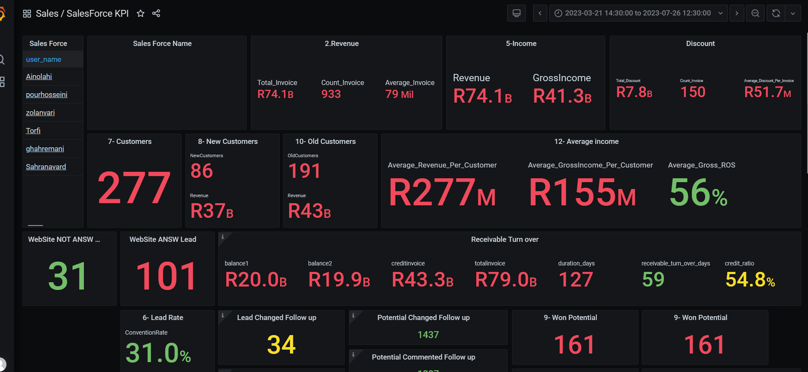

# MySQL
These scripts were written to develop a management dashboard for Vtiger CRM. The purpose of this dashboard is to showcase sales figures from different perspectives.
All the scripts were loaded into Grafana as an analytics and visializing platform.

The manager dashboard contains the following information:
1.	Demonstrating the amount of sales each salesperson achieved during a specific period of time. including complex queries to identify Sales-KPIs.

2.	Classifying customers based on features such as the number of purchases they made, annual purchase amounts, and more.
4.	Providing sales figures on a monthly and yearly basis.
5.	Displaying the amount of discounts offered to each customer.
In these scripts, I utilized the latest technologies in T-SQL to ensure high performance, such as making efficient use of "CASE" and "WHEN" statements, as well as leveraging aggregate functions, etc.
This dashboard significantly simplifies the management of the sales department, providing valuable insights into sales performance.
________________________________________
