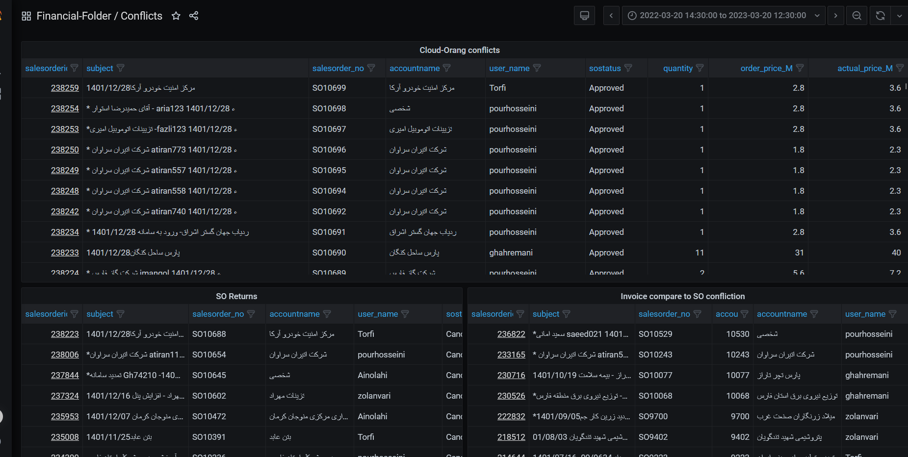

# MySQL

## Description

These scripts were written to develop a management dashboard for Vtiger CRM. The purpose of this dashboard is to showcase sales figures from different perspectives.
All the scripts were loaded into Grafana as an analytics and visializing platform.

## Usage
The manager dashboard contains the following information:
<ul>
  <li>Demonstrating the amount of sales each salesperson achieved during a specific period of time. including complex queries to identify Sales-KPIs.

</li>
    <li>Classifying customers based on features such as the number of purchases they made, annual purchase amounts, and more.</li>
    <li>	Providing sales figures on a monthly and yearly basis.
    

    </li>
    <li>Displaying the amount of discounts offered to each customer.</li>
    <li>Connecting and comparing several databases toghether, and show the result throght a union view
     

       

       

    </li>
 
  
</ul>
	
 

In these scripts, I utilized the latest technologies in T-SQL to ensure high performance, such as making efficient use of "CASE" and "WHEN" statements, as well as leveraging aggregate functions, etc.
This dashboard significantly simplifies the management of the sales department, providing valuable insights into sales performance.
   

   
## Contributions and license

> **Note:** This repository is only for sample usage and no contribution is allowed.
> All the sample codes are protected and copyrighed by Orang Pajohan Pajohan co. 

